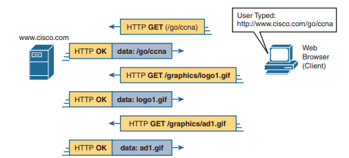

## HTTP
___


**HTTP** (англ. *HyperText Transfer Protocol* — 
«протокол передачи [гипертекста](https://ru.wikipedia.org/wiki/Гипертекст) ») - 
протокол передачи данных
[прикладного уровня](https://ru.wikipedia.org/wiki/Протоколы_прикладного_уровня) 
сетевой модели [OSI](https://ru.wikipedia.org/wiki/Сетевая_модель_OSI), 
обеспечивает доступ к сетевым службам.

В настоящее время используется для передачи произвольных данных.
В последние годы HTTP выполняет особую роль для обмена сообщениями по 
обыкновенной схеме «запрос-ответ» (Request/Response) между веб-сервисами, 
которые включают в себя различные типы [API](https://ru.wikipedia.org/wiki/API), 
в том числе [REST](https://ru.wikipedia.org/wiki/REST) и 
[SOAP](https://ru.wikipedia.org/wiki/SOAP).
___


### Передача файлов по HTTP. Технология «клиент-сервер»

После того как веб-клиент создал TCP-соединение с веб-сервером, 
клиент может начать запрашивать веб-страницу с сервера. 
Протокол HTTP, определенный в спецификации
[RFC 7231](https://datatracker.ietf.org/doc/html/rfc7231), формирует правила, 
как файлы могут передаваться между двумя компьютерами. 

HTTP определяет несколько команд и ответов, наиболее часто используемым 
из которых является HTTP-запрос **GET**. Чтобы получить файл с веб-сервера, 
клиент отправляет на сервер HTTP-запрос **GET** с указанием имени файла. 
Если сервер решает отправить файл, он отправляет ответ HTTP **GET** с [кодом 
состояния](https://ru.wikipedia.org/wiki/Список_кодов_состояния_HTTP) 
200 (что означает «ОК») вместе с содержимым файла.

Веб-страницы обычно состоят из нескольких файлов, называемых *объектами*. 
Большинство веб-страниц содержат текст, а также несколько графических 
изображений, анимированную рекламу и, возможно, голос или видео. 
Каждый из этих компонентов хранится как отдельный объект (файл) на веб-сервере. 
Чтобы получить их все, веб-браузер получает первый файл. 
Этот файл может содержать ссылки на другие 
[URI](https://ru.wikipedia.org/wiki/URI), 
поэтому браузер также запрашивает другие объекты. На рисунке показана общая идея: 
браузер получает первый файл, а затем два других файла.



В этом случае после того как веб-браузер получит первый файл, 
который называется «/go/ccna» в URI, браузер читает и интерпретирует 
этот файл. Помимо содержания частей веб-страницы, файл ссылается на 
два других файла, поэтому браузер выдает два дополнительных HTTP-запроса **GET**. 
___


### curl

**curl** — это утилита командной строки, которая позволяет выполнять 
HTTP-запросы с различными параметрами и методами. Вместо того, 
чтобы переходить к веб-ресурсам в адресной строке браузера, 
можно использовать командную строку, чтобы получить те же ресурсы, 
извлеченные в виде текста.

При посещении веб-сайта мы отправляем запрос, используя метод GET. 
Существуют и другие методы HTTP, которые можно использовать при 
взаимодействии с REST API. Вот наиболее часто используемые 
[методы](https://developer.mozilla.org/ru/docs/Web/HTTP/Methods) 
 при работе с конечными точками REST:

| HTTP метод |          Описание          |
|:----------:|:--------------------------:|
|     GET    | Чтение (получение) ресурса |
|    POST    |      Создание ресурса      |
|     PUT    |     Обновление ресурса     |
|   DELETE   |      Удаление ресурса      |

Пример запроса в командной строке Windows утилитой **curl** с ключом -I 
и параметром -X:

```
C:\>curl -X GET http://example.com -I
```
Параметр -X явно указывает метод GET, а ключ -I позволяет в ответе получать 
только заголовок:
```
C:\>curl -X GET http://example.com -I
HTTP/1.1 200 OK
Accept-Ranges: bytes
Age: 295902
Cache-Control: max-age=604800
Content-Type: text/html; charset=UTF-8
Date: Sat, 26 Mar 2022 13:12:13 GMT
Etag: "3147526947"
Expires: Sat, 02 Apr 2022 13:12:13 GMT
Last-Modified: Thu, 17 Oct 2019 07:18:26 GMT
Server: ECS (dcb/7FA7)
Vary: Accept-Encoding
X-Cache: HIT
Content-Length: 1256
```
___


> [HTTPS](https://ru.wikipedia.org/wiki/HTTPS) не является отдельным протоколом. Это обычный HTTP, работающий через 
> шифрованные транспортные механизмы SSL и TLS. Он обеспечивает защиту от атак, 
> основанных на прослушивании сетевого соединения.